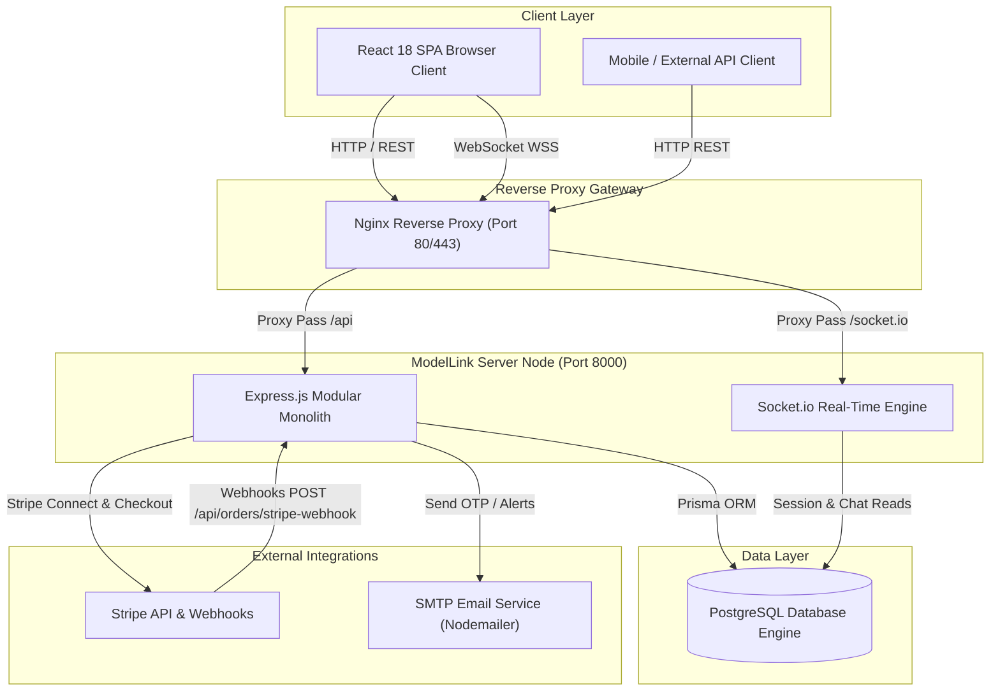
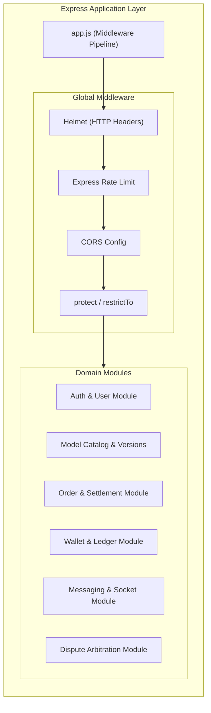
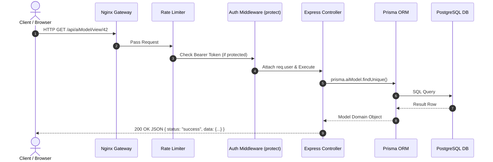
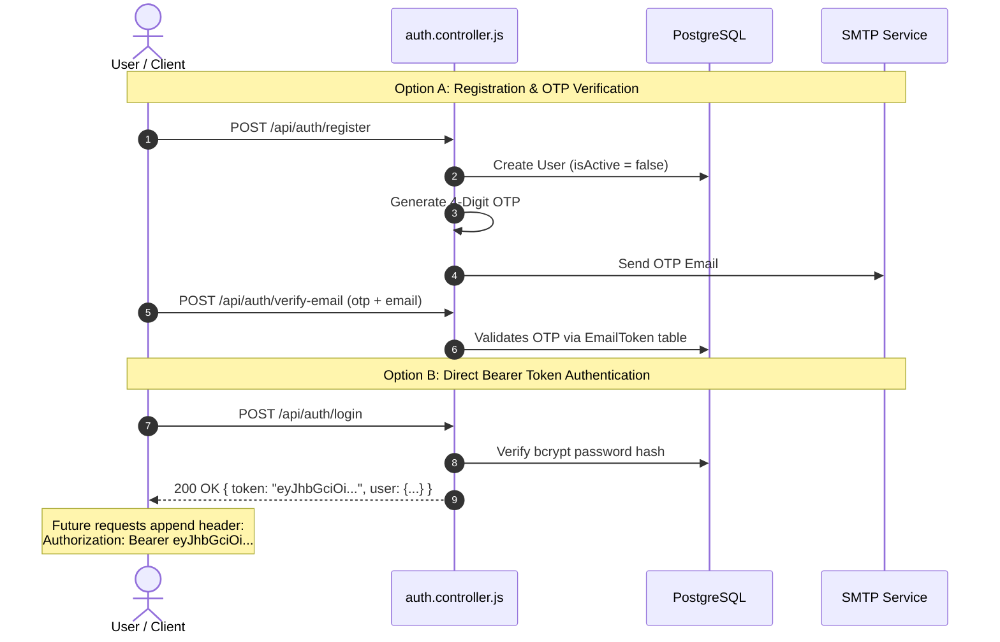
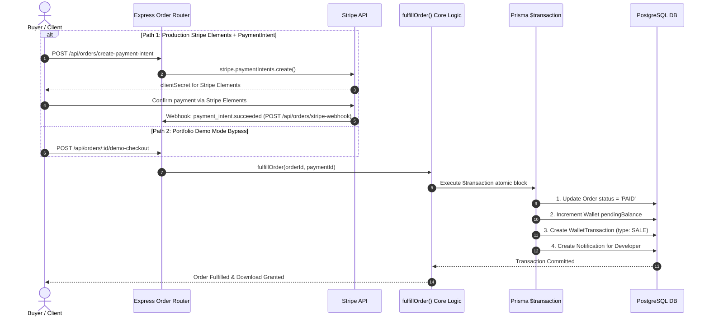
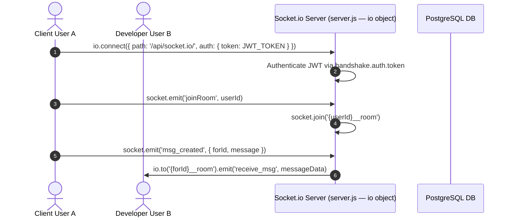
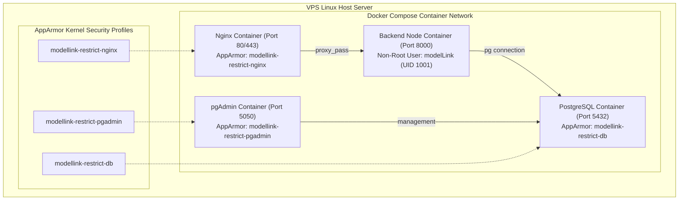

# 03 — High-Level Design (HLD) & System Topology

> **Repository**: [`modelLink_server`](../README.md)  
> **Scope**: System context, component architecture, request pipeline, authentication flow, payment settlement flow, real-time message transport, and containerized deployment architecture.

---

## 3.1 System Context Diagram

---

## 3.2 High-Level Component Architecture

---

## 3.3 Request-Response Execution Flow

---

## 3.4 Authentication & Token Verification Sequence

---

## 3.5 Unified Order Fulfillment Sequence (`fulfillOrder`)

---

## 3.6 Real-Time Socket.io Connection & Event Handling

---

## 3.7 Containerized Deployment Architecture

