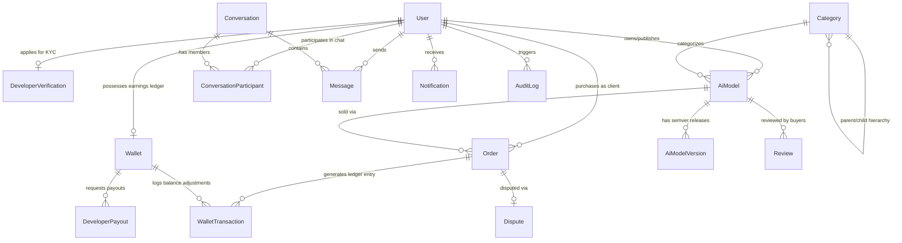

# 04 — Database Design & Financial Ledger Architecture

> **Repository**: [`modelLink_server`](../README.md)  
> **Database Engine**: PostgreSQL  
> **ORM Engine**: Prisma ORM v5.19

---

## 4.1 Prisma Entity Relationship Diagram (ERD)



---

## 4.2 Data Models Breakdown

The database schema is defined in [`prisma/schema.prisma`](../prisma/schema.prisma) and consists of **25 models**:

1. **`User`**: Core identity table storing credentials, `role` (`ADMIN`, `EMPLOYEE`, `DEVELOPER`, `CLIENT`), `customId` (human-readable ID like `DEV-a1b2c3`), Stripe Connect parameters (`stripeAccountId`, `stripeChargesEnabled`), and `deletedAt` timestamp for soft deletion.
2. **`DeveloperVerification`**: Stores KYC verification documents (`documents[]`), review notes, and verification status (`PENDING`, `APPROVED`, `REJECTED`).
3. **`AiModel`**: Central model metadata storing `title`, `description`, `price`, `status` (`DRAFT`, `PUBLISHED`, `SUSPENDED`, `ARCHIVED`), `salesCount`, and `avgRating`.
4. **`AiModelVersion`**: Semver version releases (`1.0.0`) containing encrypted file delivery asset arrays (`deliveryAssets[]`).
5. **`Category`**: Two-tier self-referential taxonomy model (`parentId`).
6. **`Order`**: Financial purchase log storing `clientId`, `developerId`, `aiModelId`, `versionId`, `status` (`PENDING`, `PAID`, `DELIVERED`, `DISPUTED`, `REFUNDED`, `CANCELLED`), `purchasePrice`, and `stripePaymentIntentId`. Contains index `@@index([versionId])`.
7. **`Transaction`**: Per-order financial record capturing `grossAmount`, `platformFee`, `developerPayout`, and `stripeEventId` (1:1 with Order).
8. **`Wallet`**: 1-to-1 developer financial ledger tracking `pendingBalance`, `availableBalance`, and `totalEarnings`.
9. **`WalletTransaction`**: Append-only transaction log tracking `walletId`, `type` (`SALE`, `PAYOUT`, `REFUND`, `PLATFORM_FEE`, `ADJUSTMENT`), and signed integer `amount`.
10. **`DeveloperPayout`**: Withdrawal request log tracking `amount`, `status` (`PENDING`, `PAID`, `REJECTED`, `CANCELLED`), and `stripeTransferId`.
11. **`Dispute`**: Buyer dispute resolution log tracking `orderId`, `reason`, `status` (`OPEN`, `UNDER_REVIEW`, `RESOLVED`, `REJECTED`), and `previousOrderStatus`.
12. **`Conversation` & `ConversationParticipant`**: 1:1 real-time messaging model using a pre-sorted unique `pairKey` string constraint (`@@unique([pairKey])`).
13. **`Message`**: Individual chat message entity.
14. **`Notification`**: In-app notifications (`ORDER`, `REVIEW`, `MODEL`, `SYSTEM`, `MESSAGE`).
15. **`AuditLog`**: System security audit trail capturing administrative modifications.
16. **`EmailToken`**: Stores hashed OTP tokens for email verification and password reset (separate from `User`).
17. **`SystemSettings`**: Platform-level settings (e.g., `platformFeeValue`, singleton row `id=1`).
18. **`WebhookEvent`**: Idempotency log for incoming Stripe webhook events (`RECEIVED`, `PROCESSED`, `FAILED`).
19. **`ModelAsset`**: Encrypted delivery assets linked to a `AiModelVersion` with typed `AssetType` enum.
20. **`AiModelFeature` & `AiModelMetric`**: Child rows for version-level feature strings and performance metric key/value pairs.
21. **`BodyPart`**: Taxonomy model for anatomical body-part tags linked to `AiModelVersion`.
22. **`Review`**: Client reviews left on purchased models (unique per model and client).
23. **`Category`**: Catalog structure categories.
24. **`Modality`**: Taxonomy classification tags linked to version.

---

## 4.3 Wallet Transaction Ledger Math (`WalletTransaction`)

Financial movements are strictly logged inside atomic Prisma transactions to prevent race conditions or balance leakage. The ledger is an **append-only log** (not a true double-entry bookkeeping system):

### Ledger Transaction Enums (`WalletTransactionType`)

- **`SALE`**: Positive credit added to `pendingBalance` upon successful order purchase.
- **`PAYOUT`**: Negative debit subtracted from `availableBalance` upon developer payout approval.
- **`REFUND`**: Negative adjustment subtracted from `pendingBalance` or `availableBalance` upon approved dispute refund.
- **`PLATFORM_FEE`**: Platform commission deduction.
- **`ADJUSTMENT`**: Administrative balance correction.

```text
┌─────────────────────────────────────────────────────────────────────────────┐
│                      State Transition Ledger Mathematics                    │
├───────────────────┬─────────────────────────────────────────────────────────┤
│ Event Trigger     │ Wallet Balance Mutation Formula                         │
├───────────────────┼─────────────────────────────────────────────────────────┤
│ Purchase Completed│ pendingBalance += purchasePrice                         │
│ Order Delivered   │ pendingBalance -= price; availableBalance += price      │
│ Payout Executed   │ availableBalance -= payoutAmount; totalEarnings += amt  │
│ Dispute Refunded  │ if (wasDelivered) availableBalance -= price             │
│                   │ else pendingBalance -= price                            │
└───────────────────┴─────────────────────────────────────────────────────────┘
```
